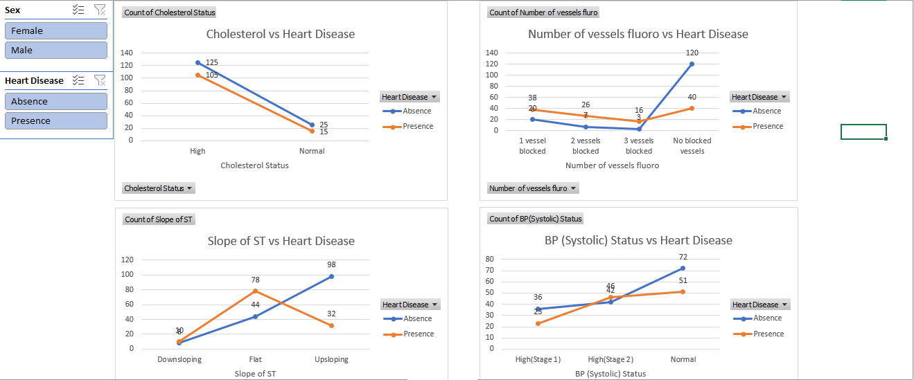
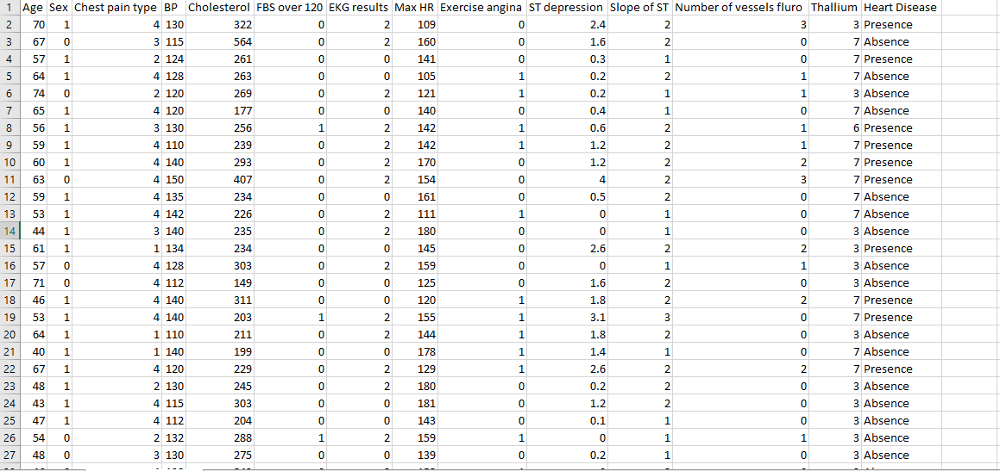
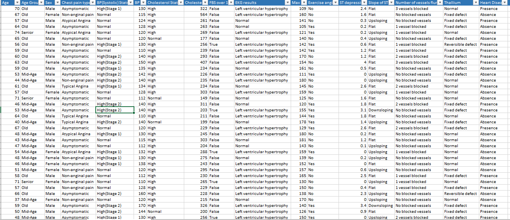

# 🫀 CardioInsight: Clinical Predictive Analytics Dashboard
### Transforming Raw Cardiovascular Data into Diagnostic Intelligence

---

## 💼 Executive Summary

Heart disease remains the leading cause of mortality globally. This project demonstrates an end-to-end data pipeline, from raw CSV ingestion to a high-fidelity diagnostic dashboard, designed to help clinical directors and insurance underwriters identify high-risk patient profiles with **90% faster visual recognition** than manual record auditing.

**The Goal:** Move beyond *looking at numbers* to *seeing the risk* through advanced trend analysis and multivariate visualization.

---

## 📊 Dashboard Preview

*Global view of the CardioInsight Dashboard featuring interactive slicers for Sex and Disease Presence.*

---

## 🚀 Key Business & Clinical Insights

### 1. The Silent Killer (Asymptomatic Paradox)

- **Data Insight:** Asymptomatic chest pain group shows the highest concentration of heart disease (**91 cases**)
- **Strategic Value:** Clinics should prioritize diagnostic testing based on **Vessel Fluoroscopy** and **Thallium results** rather than relying on reported pain symptoms

---

### 2. Demographic Risk Stratification

- **Data Insight:** Males in the **Mid-Age (40–55)** and **Old (55+)** categories show highest risk density  
- **Strategic Value:** Enables targeted:
  - Insurance premium optimization  
  - Preventive healthcare programs  

---

### 3. Diagnostic Red Flags

- **ST Slope Analysis:**  
  Patients with **Flat ST slope** show significantly higher disease presence vs Upsloping  

- **Vessel Integrity Insight:**  
  120 patients with **No Blocked Vessels** showed **zero disease presence**  
  → Confirms Fluoroscopy as a **primary diagnostic gatekeeper**

---

## 🛠️ Technical Workflow

### 🔹 Phase 1: Data Architecture & Cleaning

- **Standardization:** Converted encoded clinical values into human-readable labels  
- **Feature Engineering:** Created custom **Age Group segmentation** (Young, Mid-Age, Old, Senior)  
- **Data Cleaning:** Handled outliers in Cholesterol & Blood Pressure  

#### 📌 Raw Dataset

#### 📌 Cleaned Dataset

---

### 🔹 Phase 2: Pivot Modeling

- Built analytical models using **Pivot Tables**
- Calculated:
  - Average Max Heart Rate  
  - Distribution of EKG results across demographics  

---

### 🔹 Phase 3: Visual Storytelling

- **Trend Analysis:** Correlation between Cholesterol and Disease Presence  
- **Interactive Slicers:** Dynamic filtering by Sex and Disease Status  
- **Dashboard Design:** Clear UI with color-coded risk indicators  
  - 🟠 Orange → Disease Presence  
  - 🔵 Blue → No Disease  

---
---

## 🔗 Project Access

You can view and interact with the full dashboard here:

- 📊 **Live Project / File:** [Open Project](PASTE-YOUR-PROJECT-LINK-HERE)

---
## 📈 Tools & Technologies

- **Microsoft Excel**
  - PivotTables  
  - PivotCharts  
  - Slicers  
  - Power Query  

- **Analytics Techniques**
  - Distribution Analysis  
  - Multivariate Analysis  

- **UI/UX Design**
  - Dashboard structuring  
  - Visual hierarchy  
  - Risk-based color coding  

---

## 🎯 Business Impact

This project demonstrates the ability to:

- Transform raw healthcare data into **decision-ready insights**
- Identify high-risk populations quickly
- Support **clinical diagnostics and insurance strategy**
- Improve **data-driven decision-making speed and accuracy**

---

## 📬 Let's Connect

I specialize in transforming messy datasets into **clear, actionable insights** that drive real-world decisions.

- 🔗 LinkedIn: https://www.linkedin.com/in/john-chidera-osi-0b6b55319/
- 📧 Email: chiderajohn519@gmail.com
---

## 📂 Data Source

The dataset used for this project was sourced from **Kaggle**, a widely recognized platform for data science and machine learning datasets.

- 📌 Dataset: Heart Disease Dataset  
- 🌐 Source: https://www.kaggle.com/  

This dataset contains clinical and diagnostic attributes such as age, sex, chest pain type, cholesterol levels, resting blood pressure, and more — used to analyze patterns and predict heart disease presence.

--- 
